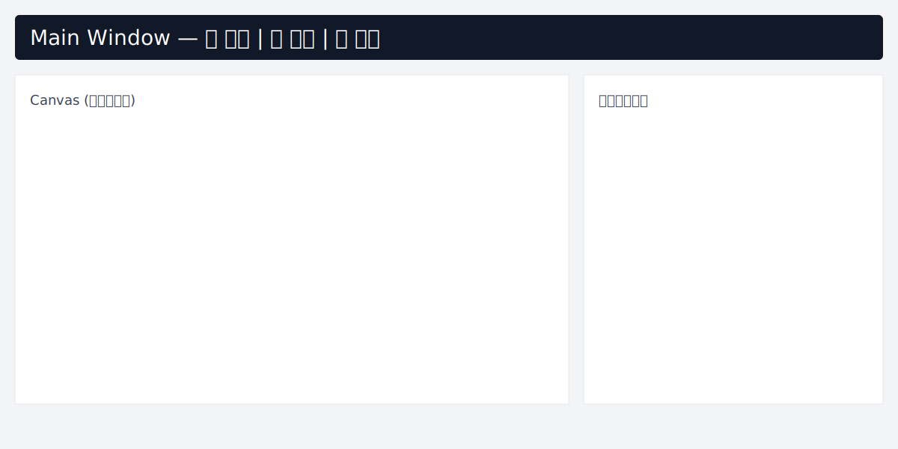

# Smart Label TT 使用者手冊

**版本**: 2.0
**更新日期**: 2025-12-06
**適用對象**: 產學合作交付、工業應用

---

## 目錄

1. [系統概述](#系統概述)
2. [快速開始](#快速開始)
3. [標註頁籤 (Annotation Tab)](#標註頁籤-annotation-tab)
4. [訓練頁籤 (Training Tab)](#訓練頁籤-training-tab)
5. [資料強化設定 (Data Augmentation)](#資料強化設定-data-augmentation) ⭐
6. [檢測頁籤 (**Detection** Tab)](#檢測頁籤-detection-tab)
7. [常見問題](#常見問題)
8. [進階功能](#進階功能)

---

## 系統概述

Smart Label TT 是一套整合式的物體標註、訓練與檢測系統，專為旋轉邊界框 (Oriented Bounding Box, OBB) 標註設計。

### 主要功能

- **智慧標註**: 使用 SAM (Segment Anything Model) 自動生成精準遮罩
- **旋轉邊界框**: PCA 演算法自動計算 OBB 參數
- **批次處理**: 一鍵處理大量圖片
- **YOLO OBB 訓練**: 整合 YOLOv10n-obb 模型訓練
- **資料強化**: 14 種可調整的訓練資料強化參數 ⭐ NEW
- **6D 姿態估計**: 支援 Simple 與 Full 模式的物體姿態檢測
- **RealSense 整合**: 支援 Intel RealSense D415 深度相機

### 系統架構

```text
Smart_Label_TT/
├── src/
│   ├── ui/              # UI 元件 (標註、訓練、檢測頁籤)
│   ├── services/        # 核心服務 (SAM, YOLO, RealSense)
│   ├── workers/         # 背景工作執行緒
│   ├── core/            # 核心邏輯 (Canvas, Config)
│   └── utils/           # 工具函式
├── runs/                # 訓練結果輸出
├── models/              # 模型檔案
└── data/                # 資料集
```

---




## 系統需求

請在安裝與執行前確認系統符合最低需求：

- **作業系統**: Windows 10/11 或 Ubuntu 20.04+（本手冊以 Windows PowerShell 範例為主）
- **Python**: 3.10.x（建議使用 conda 管理環境）
- **GPU（可選）**: NVIDIA GPU 支援 CUDA 12.8 時，可使用 `torch==2.8.0+cu128`；若無 GPU，請使用 CPU 版本的 PyTorch
- **NVIDIA 驅動**: 與 CUDA 12.8 相容的驅動（請參考 NVIDIA 官方說明）
- **RealSense（可選）**: Intel RealSense D400 系列，建議安裝 RealSense SDK 與 `pyrealsense2==2.56.x`
- **其他工具**: `git`（用於安裝某些 pip 套件）、Visual C++ Build Tools（Windows，如需編譯原始碼）

若環境中需要 GPU 支援，請先安裝正確的 NVIDIA driver 與 CUDA，再依下列方式安裝 PyTorch 的對應 wheel。

---

## 快速開始

以下提供兩種常用安裝方式：建議使用 `conda`（較能處理二進位相依），另一種為 `venv` + `pip`（較輕量，適合 CPU-only 或已知可編譯環境）。

A) 推薦：使用 Conda（含 GPU 範例）

1. 在專案根目錄開啟 PowerShell，建立並啟用環境：

```powershell
conda env create -f smart_label.yaml -n smart_label_tt
conda activate smart_label_tt
```

2. 若 `smart_label.yaml` 中仍有需要用 `pip` 安裝的套件，執行：

```powershell
pip install -r requirements.txt
```

3. 若要使用 GPU（CUDA 12.8 / PyTorch +cu128），可手動安裝對應的 PyTorch wheel：

```powershell
pip install --index-url https://download.pytorch.org/whl/cu128 torch==2.8.0+cu128 torchvision==0.23.0+cu128
```

注意：若遇到 `segment-anything` 等 git+ 套件，請確認系統已安裝 `git` 並能訪問 GitHub。

B) 輕量：使用 venv + pip（CPU 或已能解決二進位相依）

```powershell
python -m venv venv
.\venv\Scripts\Activate
python -m pip install --upgrade pip
pip install -r requirements.txt
# 如需 GPU，請另行安裝 PyTorch wheel（見上方指令）
```

啟動應用程式（GUI）範例：

```powershell
# 使用 GPU（若已安裝並指定 checkpoint 與 image 資料夾）
python app.py --image-dir "C:\path\to\images" --output-dir "C:\path\to\out" --checkpoint "C:\path\to\sam_vit_b_01ec64.pth" --device cuda

# 使用 CPU
python app.py --image-dir "C:\path\to\images" --output-dir "C:\path\to\out" --device cpu
```

常見 CLI 參數（如程式支援）：`--image-dir`, `--output-dir`, `--checkpoint`, `--device` (cpu|cuda), `--iou-threshold`。

若未提供權重檔，程式會在首次運行時嘗試自動下載預設 SAM 權重（若網路可用）。

---

## Minimal End-to-End 範例（10 張圖片驗證）

以下為最少步驟，用以驗證本系統在你的機器上可順利執行（適合初次測試或交付驗收）。

前置：建立測試資料夾並放入 10 張圖像

```powershell
mkdir C:\data\demo_images
# 把 10 張 JPG/PNG 放到 C:\data\demo_images
```

1) 啟動應用（建議先用 CPU 測試）：

```powershell
python app.py --image-dir "C:\data\demo_images" --output-dir "C:\data\demo_out" --device cpu
```

2) 標註（GUI）步驟：
- 切換到 `Annotation`（標註）頁籤。
- 點選 `選擇資料夾` 或使用 CLI 指定的 `--image-dir`，載入 `C:\data\demo_images`。
- 使用 `設定 ROI`（若想加速處理），或直接對整張圖呼叫 `🔍 執行 SAM` 生成遮罩。
- 選取遮罩後點 `儲存當前圖片` 或 `匯出所有標註`（輸出到 `C:\data\demo_out`）。

3) 訓練（快速驗證）：
- 切到 `Training`（訓練）頁籤。
- 選擇資料集資料夾（`C:\data\demo_out`），點 `配置訓練/驗證集分割`（80/20）並 `確定`。
- 設定 `Epochs=5`, `Batch Size=4`（僅做功能驗證），點 `▶️ 開始訓練`。

4) 檢測（驗證輸出）：
- 訓練完成後或載入已訓練的 `.pt` 模型，切到 `Detection`（檢測）頁籤。
- 選擇單張圖片或資料夾進行檢測，點 `🔍 開始檢測`，輸出會寫入 `C:\data\demo_out\runs` 或 UI 指定位置。

驗收條件：
- GUI 能啟動並載入圖片資料夾
- SAM 能產生遮罩並成功匯出 OBB 標註檔案
- 訓練步驟能啟動並在 `runs/obb/train/` 中生成 `results.png` 或 `weights/best.pt`（即使為小樣本）


---

## 標註頁籤 (Annotation Tab)

### 功能概述（標註）

使用 SAM 模型進行智慧標註，自動生成 OBB 格式標註檔案。

### 操作步驟（標註）

#### 1) 選擇圖片與輸出

- 點擊 `選擇資料夾`（或使用 CLI 的 `--image-dir`）載入待標註圖片資料夾。
- 支援格式：`.png`, `.jpg`, `.jpeg`, `.bmp`

#### 2) 設定 ROI (Region of Interest)

1. 點擊 `設定 ROI`，在圖片上拖曳繪製矩形區域。
2. 可拖曳邊框調整 ROI 大小，完成後點 `確認 ROI` 儲存。

用途：限制 SAM 標註範圍以提升處理速度。

#### 3) 輸出設定

- 點選 `儲存當前圖片` 或使用 `匯出所有標註` 將標註輸出至設定的輸出資料夾。

輸出格式示例：

```yaml
output_dir/
├── labels/
│   ├── image1.txt
│   ├── image2.txt
│   └── ...
└── images/  # 符號連結到原始圖片
```

#### 4) 單張標註

1. 點擊 `🔍 執行 SAM` 產生遮罩。
2. SAM 會自動偵測候選遮罩；你可按 Ctrl 多選要匯出的遮罩。
3. 選取後點 `儲存當前圖片` 或於批次模式下 `匯出所有標註`。

**OBB 格式** (YOLO OBB):

```text
class_id x1 y1 x2 y2 x3 y3 x4 y4
```

#### 5) 批次標註

1. 確認已設定 ROI 且已選擇或載入圖片資料夾。
2. 點 `開始批次標註` 開始自動處理。
3. 進度對話框會顯示處理狀態。

---

## UI 按鈕文字對照（文件名稱 → 實際 UI）

以下為文件中常用的按鈕/功能名稱與程式實際顯示文字對照，方便使用者在 UI 中快速找到對應按鈕：

- **選擇圖片資料夾**: 文件舊稱 `選擇圖片目錄` → UI 實際按鈕文字：`選擇資料夾`
- **設定 ROI**: 文件與 UI 均為 `設定 ROI`
- **生成遮罩**: 文件舊稱 `生成遮罩` → UI 實際按鈕文字：`🔍 執行 SAM`
- **儲存標註**: 文件舊稱 `儲存為 OBB` → UI 實際按鈕文字：`儲存當前圖片`（單張）或 `匯出所有標註`（批次）
- **批次標註**: 文件舊稱 `批次標註` → UI 實際按鈕文字：`開始批次標註`
- **選擇單張圖片（檢測）**: 文件舊稱 `選擇圖片` → UI 實際按鈕文字：`瀏覽`
- **啟動相機（檢測）**: 文件舊稱 `啟動 RealSense` → UI 實際按鈕文字：`啟動相機`
- **分頁標籤**: 主視窗分頁顯示為 `📝 標記`, `🎯 訓練`, `🔍 檢測`

若你在 UI 找不到某個按鈕，請以此表為準檢索；我已將文件中多處舊稱替換為程式中的實際按鈕文字。


## 訓練頁籤 (Training Tab)

### 功能概述（訓練）

使用 YOLOv10n-obb 模型訓練 OBB 檢測器。

### 操作步驟（訓練）

#### 1. 選擇資料集目錄

點擊 **「📁 瀏覽」** 選擇標註輸出目錄（包含 `labels/` 和 `images/` 的資料夾）。

#### 2. 配置訓練/驗證集分割

1. 點擊 **「📊 配置訓練/驗證集分割」**
2. 在對話框中調整分割比例（預設 80/20）
3. 可手動移動圖片到訓練集或驗證集
4. 點擊 **「確定」** 生成 `dataset.yaml`

**dataset.yaml 格式**:
```yaml
train: path/to/train/images
val: path/to/val/images
nc: 1
names: ['object']
```

#### 3. 設定訓練參數

- **訓練輪數 (Epochs)**: 建議 100-300
- **Batch Size**: 根據 GPU 記憶體調整（建議 8-16）

#### 4. 設定資料強化參數 ⭐ NEW

點擊 **「⚙️ 資料強化設定」** 按鈕開啟設定對話框。

詳見 [資料強化設定](#資料強化設定-data-augmentation) 章節。

#### 5. 開始訓練

1. 點擊 **「▶️ 開始訓練」**
2. 訓練日誌顯示於右側面板
3. 訓練曲線即時更新
4. 訓練完成後自動評估模型

#### 6. 查看訓練結果

訓練完成後，結果儲存於：
```
runs/obb/train/
├── weights/
│   ├── best.pt     # 最佳模型
│   └── last.pt     # 最後一輪模型
├── results.png     # 訓練曲線圖
└── confusion_matrix.png
```

---

## 資料強化設定 (Data Augmentation) ⭐

### 功能概述（資料強化）

資料強化（Data Augmentation）是提升模型泛化能力的關鍵技術。透過對訓練圖片進行隨機變換（旋轉、翻轉、色彩調整等），可以：

- **提升模型準確度**: 增加訓練資料多樣性
- **防止過擬合**: 模型更能適應真實場景變化
- **減少標註需求**: 從有限資料中產生更多訓練樣本

Smart Label TT 提供 **14 種可調整的 YOLO 資料強化參數**，並內建 3 種預設組合供快速使用。

### 開啟設定對話框

在 **訓練頁籤** 的訓練參數區，點擊 **「⚙️ 資料強化設定」** 按鈕。

### 使用介面

資料強化設定對話框包含 **3 個標籤頁**：

#### 1. 🔄 幾何變換

控制圖片的幾何轉換，模擬不同拍攝角度和位置。建議值示例:

- 旋轉角度 (degrees): 0-45°（輕度 5°, 中度 15°, 重度 30°）
- 平移比例 (translate): 0-0.3（輕度 0.05, 中度 0.1, 重度 0.2）
- 縮放比例 (scale): 0-1.0（輕度 0.3, 中度 0.5, 重度 0.7）
- 剪切角度 (shear): 0-20°（輕度 0°, 中度 0°, 重度 10°）
- 透視變換 (perspective): 0-0.001（建議小於 0.0005）
- 垂直翻轉機率 (flipud): 0-1.0（通常 0 或小值）
- 水平翻轉機率 (fliplr): 0-1.0（常用 0.5）

**使用建議**:
- 旋轉角度不宜過大，避免標註框超出圖片範圍
- 水平翻轉適用於左右對稱的物體（如車輛、水果）
- 垂直翻轉慎用，僅適用於可能倒置的物體

#### 2. 🎨 色彩變換

調整圖片色彩，模擬不同光照條件：

- **色相調整 (hsv_h)**: 範圍 0-0.1。HSV 色彩空間的色相調整。建議值 — 輕度 0.01、 中度 0.015、 重度 0.03。
- **飽和度調整 (hsv_s)**: 範圍 0-1.0。HSV 色彩空間的飽和度調整。建議值 — 輕度 0.5、 中度 0.7、 重度 0.8。
- **亮度調整 (hsv_v)**: 範圍 0-1.0。HSV 色彩空間的亮度（明度）調整。建議值 — 輕度 0.3、 中度 0.4、 重度 0.5。

**使用建議**:
- 色彩調整可模擬不同照明環境（室內/戶外、陰天/晴天）
- 飽和度調整幅度過大可能導致顏色失真
- 亮度調整適用於光照變化大的場景

#### 3. 🖼️ 進階強化

YOLO 特有的進階資料強化技術：

- **Mosaic 拼接機率 (mosaic)**: 範圍 0-1.0。將 4 張圖片拼接成 1 張（YOLO 特色技術）。建議值 — 輕度 0.5、 中度 1.0、 重度 1.0。
- **MixUp 混合機率 (mixup)**: 範圍 0-1.0。將兩張圖片混合（加權平均）。建議值 — 輕度 0、 中度 0、 重度 0.3。
- **Copy-Paste 機率 (copy_paste)**: 範圍 0-1.0。複製物體到其他位置（需 Mosaic）。建議值 — 輕度 0、 中度 0、 重度 0.1。
- **Random Erasing 機率 (erasing)**: 範圍 0-1.0。隨機遮蔽部分區域（提升遮擋處理能力）。建議值 — 輕度 0.2、 中度 0.4、 重度 0.5。

**使用建議**:
- **Mosaic**: YOLO 核心技術，建議啟用（0.5-1.0）
- **MixUp**: 進階技術，適用於資料量少的情況
- **Copy-Paste**: 可增加物體數量變化，但需謹慎使用
- **Random Erasing**: 提升模型對遮擋的魯棒性

### 快速預設組合

點擊對話框下方的預設按鈕，快速套用預設參數：

#### 📋 輕度強化

```text
適用場景: 資料充足、物體變化小
旋轉: 5°, 平移: 5%, 縮放: 30%
色彩調整: 保守
Mosaic: 50%
```

#### 📋 中度強化 (建議) ⭐

```text
適用場景: 一般應用（預設推薦）
旋轉: 15°, 平移: 10%, 縮放: 50%
色彩調整: 中等
Mosaic: 100%
```

#### 📋 重度強化

```text
適用場景: 資料不足、物體變化大
旋轉: 30°, 平移: 20%, 縮放: 70%
色彩調整: 積極
Mosaic: 100%, MixUp: 30%, Copy-Paste: 10%
```

### 自訂預設

#### 儲存自訂預設

1. 調整參數至理想值
2. 點擊 **「💾 儲存自訂預設」**
3. 輸入預設名稱（例如：`egg_detection`）
4. 預設檔案儲存於 `~/.smart_label/augmentation_presets/egg_detection.json`

#### 載入自訂預設

1. 點擊 **「📂 載入預設」**
2. 選擇先前儲存的 `.json` 預設檔案
3. 參數自動套用至介面

**預設檔案格式** (JSON):
```json
{
  "degrees": 15.0,
  "translate": 0.1,
  "scale": 0.5,
  "shear": 0.0,
  "perspective": 0.0,
  "flipud": 0.0,
  "fliplr": 0.5,
  "hsv_h": 0.015,
  "hsv_s": 0.7,
  "hsv_v": 0.4,
  "mosaic": 1.0,
  "mixup": 0.0,
  "copy_paste": 0.0,
  "erasing": 0.4
}
```

### 實際使用範例

#### 範例 1: 工業零件檢測

**場景**: 傳送帶上的金屬零件，角度變化小，光照穩定

**建議設定**:

- 旋轉: 10° (零件可能輕微旋轉)
- 平移: 0.1 (模擬傳送帶位置變化)
- 水平翻轉: 0.5 (左右對稱)
- 色彩調整: 低 (光照穩定)
- Mosaic: 1.0 (增加零件數量變化)

#### 範例 2: 戶外車輛檢測

**場景**: 不同時間、天氣的車輛圖片，角度變化大

**建議設定**:

- 旋轉: 20° (拍攝角度變化)
- 平移: 0.15
- 縮放: 0.6 (遠近變化)
- 色彩調整: 高 (陰晴、早晚光照變化)
- Mosaic: 1.0
- MixUp: 0.2 (模擬複雜場景)

#### 範例 3: 小物體檢測（水果、零件）

**場景**: 資料量少，需要最大化資料多樣性

**建議設定**:

- 使用 **重度強化** 預設
- 旋轉: 30°
- Mosaic: 1.0
- MixUp: 0.3
- Copy-Paste: 0.1 (複製小物體)
- Random Erasing: 0.5 (模擬遮擋)

### 訓練日誌確認

開始訓練後，訓練日誌會顯示資料強化設定狀態：

```text
使用自訂資料強化參數 (14 項)
開始訓練...
```

或

```text
使用 YOLO 預設資料強化參數
開始訓練...
```

### 注意事項

1. **GPU 記憶體**: 重度強化（Mosaic + MixUp）會增加記憶體使用，如遇 OOM 錯誤請降低 Batch Size
2. **訓練時間**: 強化程度越高，每個 Epoch 耗時越長（約增加 10-30%）
3. **驗證集**: 驗證集**不使用**資料強化，確保評估準確性
4. **標註品質**: 資料強化無法修正錯誤標註，請確保原始標註準確
5. **過度強化**: 參數設定過於激進可能導致訓練不穩定，建議從中度預設開始調整

### 效果評估

訓練完成後，比較不同強化設定的 mAP50 指標：

```text
無強化:    mAP50 = 0.75
輕度強化:  mAP50 = 0.78 (+3%)
中度強化:  mAP50 = 0.82 (+7%)
重度強化:  mAP50 = 0.81 (+6%, 過度強化)
```

**建議**: 從中度預設開始，根據 mAP 表現微調參數。

---

## 檢測頁籤 (Detection Tab)

### 功能概述（檢測）

使用訓練好的模型進行物體檢測與 6D 姿態估計。

### 操作步驟（檢測）

#### 1. 載入檢測模型

模型可由 **模型管理**（在 `Training` 頁籤中的 `模型管理` 區）匯入或選擇並註冊後在 `Detection` 頁籤使用。

注意（開發版行為）：目前程式在啟動時可能會嘗試載入預設模型路徑（參見 `src/main_window.py` 中的 `model_path`，預設為 `best.pt`），若想使用自訂模型請透過 `模型管理` 匯入或將模型放置在預期路徑。


#### 2. 選擇檢測來源

- **圖片**: 使用 `瀏覽` 按鈕選擇單張圖片（UI 顯示文字為 `瀏覽`）
- **資料夾**: 若要批次檢測，請先將圖片放入資料夾（可由 Annotation 匯出至輸出資料夾），或在 UI 中指定資料夾路徑再執行檢測
- **RealSense**: 點擊 `啟動相機`（UI 顯示文字為 `啟動相機`）以啟動 RealSense 相機（需安裝並連接相機）

#### 3. 調整檢測參數

- **信心閾值 (Confidence)**: 預設 0.15（越高越嚴格）
- **IoU 閾值**: 預設 0.3（NMS 參數）

#### 4. 選擇姿態估計模式

- **Simple Mode**: 僅估計 Z 軸旋轉（2D 平面旋轉）
- **Full Mode**: 完整 6D 姿態（位置 + 旋轉）

#### 5. 執行檢測

點擊 **「🔍 開始檢測」**，檢測結果顯示於右側面板。

#### 6. 3D 視覺化（選用）

勾選 **「顯示 3D 視覺化」**，開啟 Open3D 視窗查看點雲和姿態。

---

## 常見問題

### Q1: SAM 標註速度很慢？

**A**:

1. 確認 CUDA 可用：`torch.cuda.is_available()` 應為 `True`
2. 縮小 ROI 範圍，減少處理區域
3. 使用較小的 SAM 模型（`vit_b` → `vit_l`）

### Q2: 訓練時 GPU 記憶體不足？

**A**:

1. 降低 Batch Size (16 → 8 → 4)
2. 減小圖片尺寸 (`imgsz=640` → `imgsz=416`)
3. 使用較小模型（`yolov10n` → `yolov8n`）
4. 降低資料強化強度（重度 → 中度）

### Q3: 模型 mAP 很低（< 0.5）？

**A**:

1. 檢查標註品質（OBB 是否正確）
2. 增加訓練 Epochs（100 → 200+）
3. 使用資料強化增加訓練資料多樣性
4. 確認 dataset.yaml 路徑正確
5. 增加訓練資料數量（建議 > 500 張）

### Q4: 檢測結果有很多誤檢？

**A**:

1. 提高信心閾值（0.15 → 0.3 → 0.5）
2. 使用更多訓練資料
3. 檢查訓練集中是否有錯誤標註
4. 調整資料強化參數（避免過度強化導致模型混淆）

### Q5: RealSense 相機無法啟動？

**A**:

1. 確認已安裝 `pyrealsense2`: `pip install pyrealsense2`
2. 檢查相機連接（USB 3.0 埠）
3. 更新 RealSense SDK 驅動程式
4. 重新啟動應用程式

### Q6: 資料強化設定不生效？

**A**:

1. 確認訓練前已點擊「確定」關閉對話框
2. 檢查訓練日誌是否顯示「使用自訂資料強化參數」
3. 參數值為 0 時不會產生該種強化效果
4. 驗證集不使用資料強化（這是正常的）

---

## 進階功能

### 自訂類別 Ontology

編輯 `src/config.py` 中的 `DEFAULT_ONTOLOGY`:

```python
DEFAULT_ONTOLOGY = {
    "0": {"name": "egg", "color": "#FF5733"},
    "1": {"name": "plate", "color": "#33FF57"},
    "2": {"name": "fork", "color": "#3357FF"}
}
```

### 模型管理

訓練完成的模型自動註冊於 **模型管理** 區：

- 查看訓練日期、mAP、路徑
- 一鍵載入模型至檢測頁籤
- 刪除舊模型

### 批次輸出格式

標註輸出目錄結構：

```text
output_dir/
├── labels/
│   ├── image1.txt    # OBB 標註
│   ├── image2.txt
│   └── ...
├── images/           # 符號連結
│   ├── image1.jpg
│   ├── image2.jpg
│   └── ...
└── dataset.yaml      # YOLO 訓練配置
```

### 訓練結果分析

訓練完成後，查看以下檔案分析模型表現：

1. **results.png**: 訓練/驗證曲線
   - Box Loss: 邊界框損失（越低越好）
   - mAP50: 主要評估指標（越高越好）

2. **confusion_matrix.png**: 混淆矩陣
   - 對角線值高表示分類準確

3. **val_batch*.jpg**: 驗證集檢測結果
   - 紅框: Ground Truth
   - 藍框: 預測結果

### 資料強化效果視覺化

YOLO 訓練時會自動儲存強化後的圖片範例：

```text
runs/obb/train/
└── train_batch*.jpg    # 訓練批次視覺化（含強化效果）
```

查看這些圖片可確認資料強化是否符合預期。

---

## 技術支援

- **GitHub Issues**: [Smart_Label_TT/issues](https://github.com/your-repo/issues)
- **文件**:
  - `QUICK_REFERENCE.md` - 程式碼快速參考
  - `README.md` - 系統概述

---


